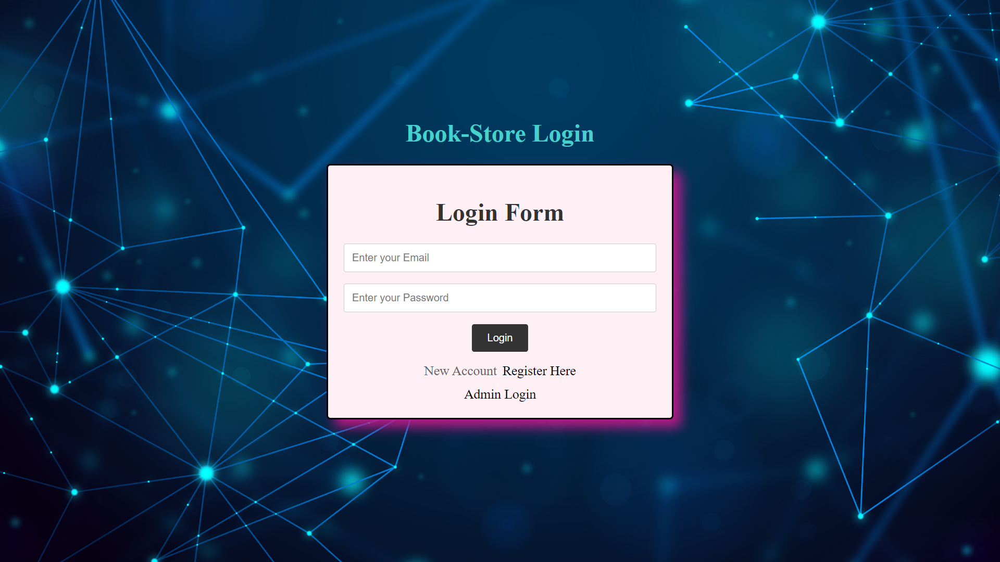
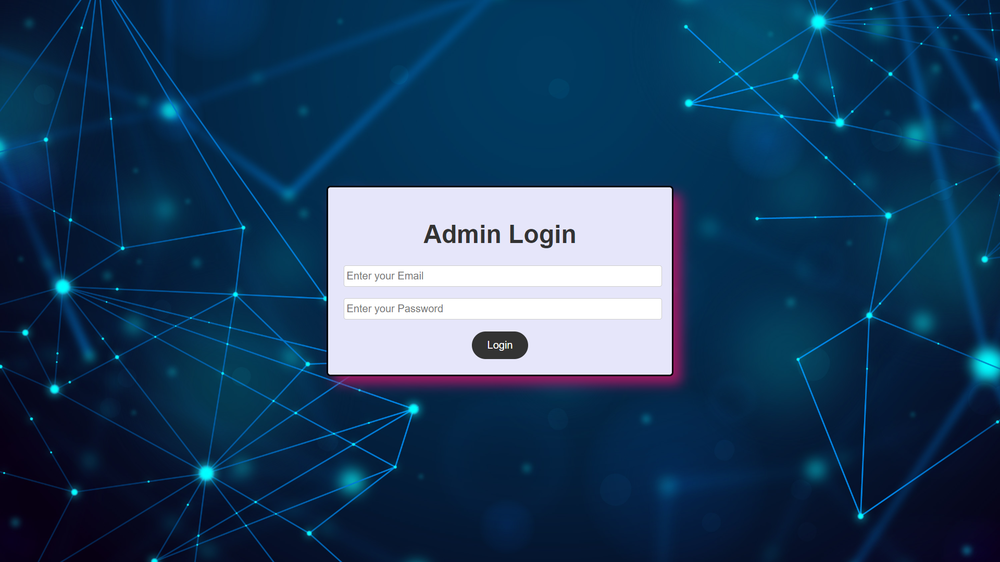

# project

1.  Get inside book-main and install node modules
    use >npm install
2.  To run the code
    use >npm run start
3.  ## Open Browser go to
        http://localhost:5000/

\*\*--> you can see login page

    

\*\*--> Registration Page

    

-- While registering you must give userid as number(integer) ----

\*\*--> To see admin login click on admin login

    

--admin login credentials should be verfied by admin given permission for testing to
username : admin@gmail.com
Password : password
